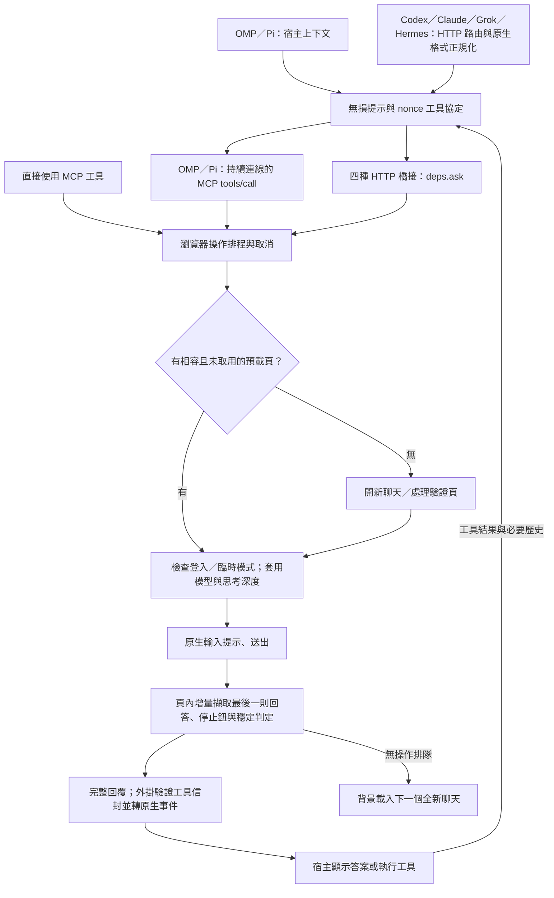

# WebChatMCP.js 驗收紀錄

只記錄實際執行過、有觀察結果的項目。「未驗證」項目不得勾選。測試環境：macOS arm64、Node v26.10.0、npm 11.19.1、TypeScript 5.9.3、Playwright 1.63.0（內建 Chromium）。

## Gate A — 規格可執行

| 項目 | 方法 | 結果 |
|---|---|---|
| 建置 | `npx tsc -p tsconfig.json` | 零錯誤，`dist/WebChatMCP.js` 等產出齊全 ✔ |
| DESIGN.md 自動產生 | `node tools/gen-design.mjs`（來源 `src/config.ts`） | ✔ 產生成功；含模型選單選擇器、環境變數、時間參數 |
| 常數集中 | 選擇器／網址／時間參數僅存於 `src/config.ts` | ✔（測試守護 DESIGN.md 與 package.json 版本一致性） |
| 文件六件套 | `PLAN.md`／`ACCEPTANCE.md`／`DESIGN.md`（自動產生）／`AGENTS.md`／`CLAUDE.md`（`@AGENTS.md`）／`README.md`（英／繁中／日三語） | ✔ |

## Gate B — 核心流程

| 項目 | 方法 | 結果 |
|---|---|---|
| MCP handshake | `npm test`：spawn `dist/WebChatMCP.js`、initialize | serverInfo=`webchatmcp.js` ✔ |
| 工具清單 | `tools/list` | 5 工具：`webchat_login`／`webchat_ask`／`webchat_models`／`webchat_status`／`webchat_close` ✔；`webchat_ask` 含 `prompt` 與 `model` 參數 ✔ |
| HTTP 直連（Streamable HTTP） | `npm test`：spawn 後 `POST /mcp` initialize＋tools/list | 200＋`Mcp-Session-Id` 會話管理正常、工具清單 5 項一致 ✔ |
| HTTP port 可配置 | 測試以 `WEBCHATMCP_PORT` 指定隨機 port；`port=0` 停用 | 自訂 port 可連線 ✔；`port=0` 時 `http.enabled=false` 且 stdio 不受影響 ✔ |
| 監聽位址 | 預設 `127.0.0.1`（loopback），`WEBCHATMCP_HOST=0.0.0.0` 可開放 | ✔（預設值與環境變數行為；0.0.0.0 實際開放未驗證） |
| webchat_status | `tools/call`（瀏覽器未啟動） | `browserRunning=false`、`loggedIn=unknown`、`chatgptUrl` 正確、含 `http` 連線狀態 ✔ |
| 瀏覽器啟動＋導航 | 無頭暫存 profile 實跑（Playwright persistent context） | Chromium 啟動、導航 `chatgpt.com` 成功 ✔ |
| 三態誠實性 | 全新無頭 profile 停在 Cloudflare「Just a moment...」 | 探測回 `unknown`，未誤判為已登入 ✔；15 秒未自動放行（實測），已實作挑戰偵測＋明確錯誤訊息 |
| webchat_login 人工登入全流程 | — | **未驗證**（需使用者實際登入） |
| webchat_ask 臨時聊天送提示＋回覆擷取 | — | **未驗證**（需登入後實測） |
| webchat_models 清單擷取／model 切換 | — | **未驗證**（需登入後實測） |

## Gate C — 交付驗收

| 項目 | 方法 | 結果 |
|---|---|---|
| 單元測試 | `npm test` | 3 通過／0 失敗 ✔ |
| OG 分享圖 | PIL IHDR 核對＋目視檢查 | `og.png` 1200×630、`og@2x.png` 2400×1260 ✔；英文文案、無錯字、無重疊裁切、構圖平衡 ✔ |
| favicon.ico | PIL 解析 ICO 目錄＋目視 48px | 16／32／48 三尺寸齊 ✔；W 字樣清晰置中 ✔ |
| OG 標籤 | `index.html` `<head>` 檢查 | og:title／description／image／url＋twitter:card 全英文、`og:image` 指向 `assets/social/og.png` ✔ |
| 官網 | `curl` 實測 | `https://webchatmcp.js-package.xyz/` 回 200 ✔；`/assets/social/og.png` 200（70,979 B）✔；`/favicon.ico` 200（2,505 B）✔ |
| 推送 | `git push origin main`＋GitHub contents API | main 更新至 `2955c8a`，根目錄 18 項檔案齊全 ✔ |
| Release v1.0 | `gh release create v1.0`（zip＋`SHA256SUMS`） | [v1.0](https://github.com/JS-PACKAGE/WebChatMCP.js/releases/tag/v1.0) 發佈 ✔；`WebChatMCP.js-v1.0.zip` 285,867 B、37 檔、含 `dist/` 不含 `node_modules` ✔ |
| SHA-256 複核 | 自 GitHub 重新下載資產後 `shasum -a 256 -c SHA256SUMS` | `21d5e056…8e0b7` 一致（`OK`）✔ |

## 已知問題與未驗證項目

- **未驗證（需真實 ChatGPT 登入）**：`webchat_login` 人工登入全流程、`webchat_ask` 完整送提示與回覆擷取、`webchat_models` 清單擷取、`model` 切換。上述功能的自動化邏輯已完成並通過靜態驗證（建置、MCP 契約、工具註冊），實際對話流程待首次真人登入後驗收。
- 無頭模式（`WEBCHATMCP_HEADLESS=1`）全新 profile 會被 Cloudflare 挑戰擋下（實測 15 秒內未自動放行）；預設可視模式不受影響，首次登入必須使用可視瀏覽器。
- ChatGPT UI 改版可能使選擇器失效；全部集中於 `src/config.ts`，修復只需改選擇器並重跑 `npm run build`。

## 端到端延遲與無損上下文優化驗收

本節為獨立的新測量，前文保留歷史驗收紀錄。環境：macOS arm64、Node v26.7.0、Playwright Chromium。優化前為本次修改前的 `bf57c45` 完整程式快照；優化後為本工作樹，`dist/` 已重新建置。沒有連線到真實聊天服務、讀取私人 profile 或代替使用者登入。

### 相同條件的六外掛端到端比較

實際啟動隔離 Chromium、WebChatSession 與排程器；Codex／Claude／Grok／Hermes 經本機 HTTP 橋接，OMP／Pi 經 SDK Streamable HTTP MCP 加宿主串流轉換。以路由攔截提供同一 Gemini 測試頁：導航固定延遲 80ms、`gem-menu` 不帶 `role="menu"`、指定 Flash；送出後 100ms 出現首段、700ms 完整生成。每次使用相同 10 字元提示與 2,178 字元完整回答，逐字核對結果。瀏覽器啟動與 MCP 握手在計時外；每個版本每個外掛 3 次、輪替順序，以下為中位數。

「首字」是宿主收到非空回答文字，不是 SSE created／start／heartbeat。所有外掛仍先收完整網頁回覆再驗證，因此首字與完成時間很接近。這是可控 UI／傳輸測量，**不能外推為真實模型生成速度的提升**。

| 外掛 | 首字前／後 ms | 完整回覆前／後 ms | 完整回覆減少 |
|---|---:|---:|---:|
| OMP | 5766.77／1955.42 | 5766.78／1955.43 | 66.1% |
| Pi | 5597.93／1942.08 | 5597.95／1942.09 | 65.3% |
| Codex | 5771.44／1688.78 | 5771.59／1689.00 | 70.7% |
| Claude | 5887.13／1920.34 | 5887.16／1920.45 | 67.4% |
| Grok | 5750.08／1954.08 | 5750.18／1954.21 | 66.0% |
| Hermes | 5880.48／1941.26 | 5880.58／1941.37 | 67.0% |

主要差異來自修正 Gemini 等待錯誤選單表面的約 4 秒空等，並非調低穩定判定門檻。相同提示及回答的橋接 SSE 位元組數未因裁切而減少。

### 不切換模型的對照組

同一測試程式改為不指定模型，其他條件不變、每個外掛每版 3 次。此路徑不經過本次主要修正的選單等待；首字與完成仍相差不到 1ms。**這組沒有一致加速，不宣稱普遍提升。**

| 外掛 | 完整回覆前／後 ms | 送出提示後至完成前／後 ms |
|---|---:|---:|
| OMP | 1468.91／1463.21 | 1191.49／1187.69 |
| Pi | 1451.40／1815.99 | 1192.29／1189.08 |
| Codex | 1449.05／1426.04 | 1192.46／1186.95 |
| Claude | 1418.59／1466.51 | 1192.30／1190.42 |
| Grok | 1476.02／1470.13 | 1187.33／1188.49 |
| Hermes | 1797.86／1791.43 | 1190.17／1190.63 |

合併 18 次完整回覆的中位數為 1462.66→1468.32ms；單次範圍重疊。Pi 的完整回覆中位數這組反而增加約 365ms，測到的提示送出前時間增加約 370ms，送出後沒有相同增加；3 次樣本不足以判定成因或排除啟動／導航抖動，故如實保留，不當成提升。上述百分比改善僅適用前表的 Gemini 指定模型情境。

### 個別階段與取捨

- 相同 24 項 radio 選單，實際 CDP `Runtime.callFunctionOn` 次數由 140 降到 71；Gemini 清單由 4076ms 降到 174ms。12 組選單 fixture 的模型／思考深度結果一致；Claude 已選中的思考項目不再重點。ChatGPT 滑桿仍完整掃描並還原未知深度，點選後不收起的選單仍等待既有安全上限，並非每種選單都有明顯的牆鐘時間改善。
- 相同 80ms 導航 fixture，重複暖機中位數由 130.40ms 降到 0.73ms，新增導航次數由 1 降到 0（各 3 次）；只重用有效且未取用的聊天，下一題仍不沿用已送出過的聊天。
- OMP／Pi 的獨立 HTTP fixture：完整 131,072-byte 回答於 15ms 送完，EOF 延至 150ms；每種各 6 次。OMP 中位數 156.05→17.67ms，Pi 156.22→18.03ms。現在完整且 id 相符的 RPC 結果一到就交付；若伺服器原本立即關閉，收益會很小。
- 同一 976,032 字元完整上下文的本地提示組裝：舊版關閉裁切後 0.1087ms、新版 0.1008ms 中位數（9 組×100 次）；區間重疊，不宣稱端到端顯著加速。舊預設只保留 198,477 字元，不是合格的無損比較基準。移除裁切與恢復 schema／宿主指示後，長對話傳輸量可能增加。
- 不搶先輸出可能被 DOM 改寫的文字或未驗證工具信封，不縮短回覆穩定取樣，不刪除原生協定必要的完成事件。真實網站導航、模型排隊／生成、長提示的瀏覽器輸入與每輪完整上下文仍是瓶頸。

### 全流程檢視範圍

啟動時由設定與資料型 JSON 外掛註冊 provider，之後共用同一套 session／選單／排程流程；資料型外掛沒有另外一條模型傳輸管線。模型探索、登入、登出、狀態與關閉仍走既有鎖與三態探測；登入只允許使用者操作，登出只清指定服務網域。

也檢查了外掛模型清單快取、安裝設定、上游 passthrough、壓縮與串流 backpressure。保留原本有效的 UA／模型快取、非同步解壓與原樣轉送，沒有為了減少必要 JSON 解析而改掉非網頁模型的路由判斷，也沒有刪掉原生 SSE 的必要終結內容。安裝／反安裝腳本不在每題熱路徑，本次不改動。

### 長多行提示的剩餘成本

額外以乾淨 contenteditable、同一 Chromium 的原生 `keyboard.insertText` 測量，不經模型或外部網路。每次插入後逐字比對完整內容。

| 提示字元數 | 行數 | 原生輸入 ms |
|---:|---:|---:|
| 289033 | 16 | 21.03 |
| 289033 | 256 | 59.84 |
| 289033 | 1024 | 459.35 |
| 289033 | 4096 | 6548.85 |

進一步使用同一份 301,993 字元／4,096 行、含 Unicode 與縮排的提示，單次輸入 8242ms；分成 256／64／16 行的原生批次分別為 8558／8497／8839ms，並未改善。因此沒有加入分批造成的更多 RPC／input 事件，也沒有用剪貼簿、直接改 DOM 或合併換行來冒險繞過網站編輯器。此處是已確認但本次未消除的瓶頸；最初 17,000 行工具 smoke 未能完成（僅留下 502，未確認其單一成因），正式的六外掛 smoke 改用同等大內容、較少換行來驗證無損傳輸，不能把它當成多行輸入已優化的證明。

### 整合驗證

- `npm run build`、`npm run gen:design` 成功，TS 與提交用 `dist/` 同步。
- `npm test`：162 tests passed、0 failed、0 skipped。涵蓋三種選單、預載重用／相容性／一次性取用、取消、六宿主工具協定、超過舊裁切上限的上下文、UTF-8／分段 SSE／EOF 以及指定工具與串行限制。
- 六外掛各以實際 Chromium 執行兩輪工具呼叫：第一輪傳原生 `read_file` 呼叫，第二輪回送同一呼叫 ID 與 **289,033 字元完整工具結果**。網頁端收到約 290,779 字元提示（Codex 290,782），逐字確認內容、系統指示與 schema，最終答案完整返回，沒有使用真實帳號或外部服務。
- 官網以本機 HTTP 實際開啟 Chromium 檢查更新段落；五段修改後的繁中說明與 README 正規化後逐字一致，六外掛 README 同步說明無損上下文及 SSE 行為。

